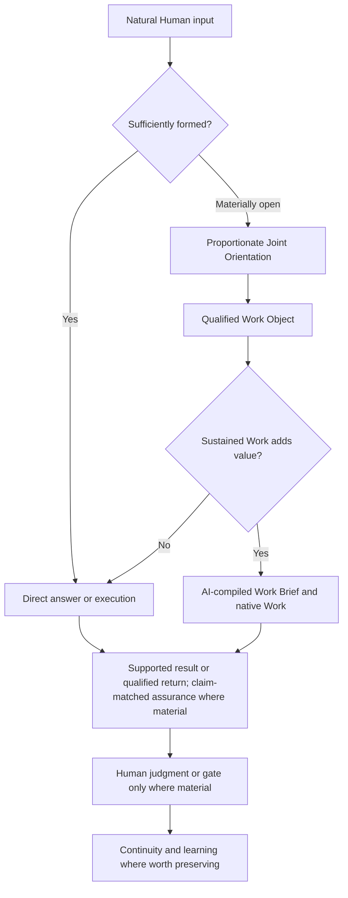

# Joint Intelligence Runtime Realization — Candidate Assessment — 2026-09-06

**Status:** CANDIDATE for Human review; not accepted, promoted, installed, behaviorally conformant, or outcome-validated.
**Authoritative recovery base:** `main@9d195dd2270557c901c47147ed2411bd51ad6e59`.
**Change branch:** `candidate/joint-intelligence-runtime-realization-2026-09-06`.
**Decision owner:** Human.
**Claim:** exact current-state assessment, bounded repository Candidate, static semantic-regression evidence, and genuine-use test readiness only.

## 1. Determination

The native-first architecture remains sound and should stay closed. The current system does not lack a Formation component, orientation stage, provider router, state engine, or new generic Skill.

| Current carrier/allocation | Existing adequate realization | Assessment |
|---|---|---|
| Canonical Joint-Work Semantics | CJS-01 connects local work to Parent Outcome and causal dependencies; CJS-03 adds hypotheses/evidence/alternatives beyond paraphrase; CJS-04/05 qualify knowledge and resist premature collapse; CJS-06/07/08/09 bind quality, allocation, recovery and calibrated reliance. | **ADEQUATE / RETAIN**, with only the practical AI-literacy consequence in CJS-13 sharpened. |
| Global CI R3 | Direct execution for formed work; materially open frame development; wider-outcome, causal, alternative, knowledge, quality, recovery, Human-authority and conditional Work-handoff cues. | **MOSTLY ADEQUATE / BOUNDED REPAIR** at the natural-input frontier and handoff-authorship cue. |
| Native Work Transition | Formation Sufficiency, protected qualified state, Work-owned planning, runtime freedom, reopen/return conditions, Human gates and direct collapse for ordinary work. | **MOSTLY ADEQUATE / BOUNDED REPAIR** for Specification projection, AI authorship and operationally light expression. |
| Active Skills | `decision-analysis`, `evaluate-work-product`, and `system-development` perform differentiated methods after their bounded objects/claims exist; they do not own generic orientation. | **ADEQUATE / RETAIN UNCHANGED**. |
| Current operating allocation | Native Chat owns ordinary integration and capability selection; Work owns sustained execution; Skills are optional method providers; NWT owns the conditional bridge; domain sources retain authority. | **ADEQUATE / RETAIN UNCHANGED**. |

The current Canonical Joint-Work Semantics already own the main Joint Orientation obligations. Two material activation gaps and one bounded semantic refinement remain:

1. Global CI R3 asks Chat to develop materially open work, relate it to the wider outcome, reason causally, and preserve alternatives, but does not compactly activate recognition of the **relevant system/object** or whether the starting point is a **symptom, cause, opportunity, proposed means, or sufficiently qualified Work Object**. This leaves premature local optimization possible without violating the literal carrier.
2. NWT defines a context-complete handoff but can still be read as a contract the Human must author. The sending AI's responsibility to recover accessible state, compile the Work Brief, and reduce the Human action to the smallest unavailable/product-bound step is not explicit enough.
3. CJS-09 and CJS-13 already own calibrated reliance and Human capability effects, but the practical AI-literacy consequence is under-specified: real work should sometimes make the mechanism behind specification, verification, gate, limitation-locus, and autonomy/review choices briefly legible.

The smallest responsible repair is therefore:

- sharpen CJS-13 inside its existing owner;
- test a bounded R4 Global-CI recompilation carrying Joint Orientation, practical AI-literacy, and AI-compiled handoff salience;
- repair NWT at the handoff carrier with AI authorship and Specification → Work Brief projection semantics;
- retain the current operating allocation and all three active Skills unchanged;
- validate through genuine work after a separately authorized installation/readback, not through a new process or synthetic compliance suite.

## 2. Explicit retain / repair / reject decisions

| Object | Decision | Reason and boundary |
|---|---|---|
| Native-first operating model | **RETAIN** | The gaps are carrier salience and handoff usability defects, not missing architecture ownership. |
| `baseline/CANONICAL-JOINT-WORK-SEMANTICS.md` | **RETAIN + BOUNDED REPAIR CJS-13** | CJS-01/03/04 already own Joint Orientation; CJS-09/13 own calibrated reliance and learning. Only the AI-literacy consequence is sharpened. |
| `baseline/OPERATING-BASELINE.md` | **RETAIN UNCHANGED** | Native Chat, Work, Skill, authority, and persistence allocation remains fit. |
| Global CI R3 | **RETAIN AS PREDECESSOR / TEST R4 REPAIR** | R3 already preserves the hard floors. R4 adds a compact open-input discriminator and explicit handoff compilation without an Entry controller. |
| `baseline/NATIVE-WORK-TRANSITION.md` | **REPAIR** | Make AI handoff authorship, proportional representation, and Specification ≠ Work Brief explicit within the existing transition owner. |
| `decision-analysis` | **RETAIN UNCHANGED** | It actively binds and analyzes bounded choices using viable options, uncertainty regime, downside, information value, strongest rival, switching condition, and a bounded disposition. |
| `evaluate-work-product` | **RETAIN UNCHANGED** | It actively binds an exact product/use/claim, resolves a professional basis, selects failure-capable operations, preserves product identity, and returns a claim-relative disposition. |
| `system-development` | **RETAIN UNCHANGED** | It actively selects and applies scoped recovery, failure-localization, semantic-regression, promotion/readback, and genuine-use methods. |
| New `work-formation`, `joint-orientation`, `AI-literacy`, or `work-architecture` Skill | **REJECT** | The needs are generic interaction/transition semantics already owned by native Chat, CJS, Global CI, and NWT; a Skill would duplicate ownership and add activation burden. |
| Mandatory Orientation/Spec stage, Orientation Brief, universal QWS/Work Contract, controller/router, state engine | **REJECT** | Legacy evidence shows ceremony and strict Entry enforcement do not reliably solve the runtime problem and can displace the Parent Outcome. |
| No repository change | **STRONGEST RIVAL; NOT SELECTED FOR CANDIDATE TEST** | R3 may already be behaviorally sufficient, but current wording leaves the identified gaps passable. R4 remains reversible and its incremental value can be tested in genuine use. |

## 3. Current product and carrier evidence

Current official OpenAI documentation supports the current allocation while leaving automatic Chat→Work transfer unproven:

- [ChatGPT Work prompting guidance](https://learn.chatgpt.com/docs/prompting) distinguishes Chat for quick questions/brainstorming/light drafts from Work for multi-source, multi-step, change-making, or larger deliverables, and asks for result, sources, audience, and review expectations.
- [Get started with ChatGPT Work](https://learn.chatgpt.com/docs/get-started-with-work) describes Work as delegation of substantial tasks with a clear outcome and reviewable result; Work can use files, plugins, and approved tools while the Human can steer and approve important actions.
- [Personalize ChatGPT](https://learn.chatgpt.com/docs/personalize) assigns cross-chat preferences to custom instructions and separates memories from required project guidance.
- [Skills & Plugins](https://learn.chatgpt.com/docs/skills-and-plugins) defines a Skill as task-specific reusable workflow guidance whose name/description support matching, and recommends Skills where good results depend on a repeatable approach.

These sources support Global CI as a compact preference carrier, native Work as the substantial execution surface, and Skills as focused method/workflow providers. They do **not** establish that arbitrary Chat automatically reads this repository, initiates a Work transition, activates a Skill correctly, or preserves qualified state. Those remain runtime claims requiring exact-surface evidence.

The repository's 5,000-character Global-CI envelope is retained as the current operational carrier constraint. The reviewed official personalization page does not state a numeric limit, so this run does not upgrade that repository constraint into a general product fact.

## 4. Bounded carrier decision

**Decision:** Which lowest responsible carrier should address the remaining Joint Orientation and handoff gaps without reopening architecture?

**Options considered:** no change; Canonical-only clarification; bounded Global CI + NWT repair; new generic Skill; custom controller/runtime.

**Decisive objectives and constraints:** cross-chat salience at the natural-input frontier; preservation of direct bounded work; low Human orchestration; native Work execution lift; no mandatory ceremony; no false authority/capability claim; <=5,000-character repository envelope; reversible product test.

**Analytical disposition:** `RECOMMEND_REVERSIBLE_TEST` of the bounded Global CI + NWT repair after Human review, authorized repository promotion, exact product installation/readback, and no other product-state change.

The strongest rival is **R3 unchanged**. It becomes preferable if genuine use of the exact R3 identity already shows consistent open-input orientation and AI-authored handoffs without avoidable Human correction. R4 becomes materially preferable if R3 repeats premature solution collapse, wrong-system framing, Human-authored handoff burden, or opaque AI allocation choices. A strict Entry/Admission controller is not a credible rival: exact-install Legacy tests failed the tested Global-CI-only enforcement family 2/2.

## 5. Minimal target runtime model



These are conditional semantic relationships, not mandatory stages. Joint Orientation is behavior, not a visible lifecycle. A compact snapshot may emerge when it helps common ground or handoff, but no Orientation artifact is required.

## 6. Exact Candidate changes

| Path | Candidate delta |
|---|---|
| `baseline/CANONICAL-JOINT-WORK-SEMANTICS.md` | Extend CJS-13 with proportionate practical AI-literacy / calibrated-reliance semantics. |
| `baseline/NATIVE-WORK-TRANSITION.md` | Add Specification projection, Specification ≠ Work Brief, AI-compiled handoff, minimum Human action, and non-template wording; retain all existing activation, Formation Sufficiency, runtime freedom, reopen, authority, and return protections. |
| `rebaseline/CURRENT-GLOBAL-CUSTOM-INSTRUCTIONS-2026-09-06-R4.md` | Add exact 4,979-character R4 payload and bounded claim. |
| `rebaseline/CURRENT-GLOBAL-CUSTOM-INSTRUCTIONS-2026-09-06.md` | Add conditional supersession safety for the R3 action-bearing payload. |
| `CURRENT.md`, `README.md`, `inventory/PRESERVATION-COVERAGE.md` | Candidate pointers, exact R4 identity, delta boundary, and next Human/product gates. |
| this assessment | Bind evidence, decisions, semantic regression, validation, risks, and transition limits. |

No Skill package, plugin manifest, Project Instruction, Legacy file, installed product setting, external state, or merge is changed.

## 7. Global CI R4 delta and static regression

### Exact envelope

| Property | R3 control | R4 Candidate |
|---|---:|---:|
| Unicode code points | 4,943 | 4,979 |
| UTF-8 bytes | 4,943 | 4,979 |
| Paragraphs | 7 | 7 |
| Payload terminal newline | none | none |
| CRLF-equivalent length | 4,955 | 4,991 |
| SHA-256 | `e5de13b5989590959829ae12207f1269f691603d3c4f99568b4f68101be20985` | `78b0628b726396168d5b2821404a1f391c2dc655f2ee46f56e95c0bd669dbe14` |

R4 recompiles rather than appends: paragraphs 1–4 are tightened to make space, paragraph 5 changes `hand off context-completely` to the more operational `compile a context-complete handoff`, and paragraphs 6–7 remain unchanged. Lexical difference alone is not assurance; the obligation inventory follows.

### Claim-bounded obligation inventory

Target claim: preserve all 38 globally effective cooperation units reconstructed for R2, preserve the seven R2 sharpenings and three R3 repairs, and add the three R4 cues. This is not whole-CJS equivalence or behavioral conformance.

| # | Material obligation | R4 locus / classification | Static result and behavioral limit |
|---:|---|---|---|
| 1 | Shared thinking on qualified state | ¶1 `Think together from shared state` — EMBEDDED | PRESERVED; runtime quality unverified. |
| 2 | Direct response/execution when formed | ¶1 — EMBEDDED | STRENGTHENED; anti-ceremony behavior unverified. |
| 3 | Develop materially open problem/frame/quality/direction | ¶1 open-input orientation — EMBEDDED | PRESERVED + sharpened. |
| 4 | Add intelligence beyond paraphrase | ¶1 hypotheses/causal structure/alternatives/knowledge/counterpoints/probes — EMBEDDED | PRESERVED. |
| 5 | Stable frame; reshape only for material weakness | ¶2 — EMBEDDED | PRESERVED. |
| 6 | Tentative material ≠ commitment; explicit requirements may bind | ¶2 + opening sentence — EMBEDDED | PRESERVED. |
| 7 | Material alternatives and discriminating questions/contrasts/prototypes | ¶1–2 — EMBEDDED | PRESERVED without option quota. |
| 8 | Structural relations among outcomes, causes, dependencies, constraints, trade-offs, future effects, reversibility, switching | ¶1/¶3 — EMBEDDED | PRESERVED. |
| 9 | Contradictions/weak signals expose fragile assumptions | ¶3 — EMBEDDED | PRESERVED. |
| 10 | Counterfactual/prediction/estimate/scenario reasoning when useful | ¶3 — EMBEDDED | PRESERVED. |
| 11 | Outcome and justified quality before simplification | ¶4 — EMBEDDED | PRESERVED. |
| 12 | Human input is material, not quality ceiling | ¶4 — EMBEDDED | PRESERVED. |
| 13 | Quality calibrated to audience/use with references/contrasts | ¶4 — EMBEDDED | PRESERVED. |
| 14 | Care beyond first plausible result | ¶4 — EMBEDDED | PRESERVED. |
| 15 | Professional depth and qualified method/provider when validity depends | ¶4 — EMBEDDED activation cue | PRESERVED; actual provider fit/use remains episode-specific and UNVERIFIED. |
| 16 | Mixed Initiative; AI owns AI-resolvable work | ¶5 — EMBEDDED | PRESERVED. |
| 17 | Recover accessible context rather than Human reconstruction | ¶5 — EMBEDDED | PRESERVED. |
| 18 | Recover/requalify before consequential work | ¶5 — EMBEDDED | PRESERVED. |
| 19 | Human values/taste/lived context/judgment/authorship/commitment/acceptance/release | ¶5 — EMBEDDED | PRESERVED. |
| 20 | Material direction/state/commitment/reliance changes visible | ¶5 — EMBEDDED | PRESERVED. |
| 21 | Carry qualified decisions/corrections/rejections/constraints/assumptions/quality signals | ¶5 — EMBEDDED | PRESERVED. |
| 22 | Reopen only invalidated state; refresh fit | ¶5 — EMBEDDED | PRESERVED. |
| 23 | `Go`/authorization executes agreed step absent blocker | ¶5 — EMBEDDED | PRESERVED. |
| 24 | Work transition on formation sufficiency + execution lift | ¶5 — EMBEDDED activation cue; detailed NWT owner | PRESERVED + operationally sharpened; transition availability/behavior UNVERIFIED. |
| 25 | Correction repairs disputed point/dependencies | ¶5 — EMBEDDED | PRESERVED. |
| 26 | Reactions inform local state, not facts/persisted learning | ¶5 — EMBEDDED | PRESERVED. |
| 27 | Reality and epistemic type distinctions | ¶6 — EMBEDDED hard floor | PRESERVED. |
| 28 | Context/retrieval/memory/storage/AI generation ≠ truth/currentness/authority/acceptance | ¶6 — EMBEDDED hard floor | PRESERVED. |
| 29 | Verify material current facts; expose conflicts; narrow claims | ¶6 — EMBEDDED hard floor | PRESERVED. |
| 30 | Never invent facts/sources/evidence/actions/capability/state/completion/outcomes | ¶6 — EMBEDDED hard floor | PRESERVED. |
| 31 | Failed retrieval/capability use ≠ absence | ¶6 — EMBEDDED hard floor | PRESERVED. |
| 32 | Fallback preserves method/evidence/authority/quality/claim or exposes boundary | ¶6 — EMBEDDED hard floor | PRESERVED. |
| 33 | No simulated execution/degraded substitute under unchanged claim | ¶6 — EMBEDDED hard floor | PRESERVED. |
| 34 | Plain language; mechanisms/evidence over ritual/process | ¶7 — EMBEDDED | PRESERVED. |
| 35 | Enough causal structure for independent reasoning | ¶7 — EMBEDDED | PRESERVED. |
| 36 | Persist while valuable; converge when uncertainty resolved/contained and quality frontier reached | ¶2/¶7 — EMBEDDED | PRESERVED, including R3 containment repair. |
| 37 | Ask only for material non-resolvable Human input or authority | ¶7 — EMBEDDED | PRESERVED. |
| 38 | Reversible minor assumptions; bounded work directly | ¶7 — EMBEDDED | PRESERVED. |
| 39 | Orient materially open input to wider outcome, relevant system/object, and input type | ¶1 — EMBEDDED new cue | STATIC PASS; behavioral discrimination unverified. |
| 40 | Practical AI-literacy/calibrated-reliance explanation only when material | ¶4 — EMBEDDED new cue; CJS-13 owns detail | STATIC PASS; benefit/burden unverified. |
| 41 | ChatGPT compiles the context-complete Work handoff | ¶5 — EMBEDDED new cue; NWT owns content | STATIC PASS; direct native transition access and behavior unverified. |

The successor-specific obligations outside the original 38-unit review are also explicit:

| Predecessor delta | R4 locus | Result |
|---|---|---|
| Proposed means remain provisional unless explicitly required | ¶2 | PRESERVED |
| Evidence, analogies and probes may improve a materially weak frame | ¶1–2 | PRESERVED |
| Qualified knowledge is a floor, with fit checked before use | ¶1/¶3 | PRESERVED |
| Transfer/recombine before unnecessary reinvention | ¶3 | PRESERVED |
| Adapt or combine complementary functions without role inflation | ¶1 | PRESERVED |
| Build transferable understanding when learning/future autonomy is material, without tutor friction | ¶4 | PRESERVED; AI-specific mechanism sharpened |
| Proportionate consequential completion check | ¶7 | PRESERVED |
| R3: remove blanket Human-before-execution wording | ¶1/¶5/¶7 | PRESERVED |
| R3: wider-outcome / next-investment sufficiency | ¶1–2 | PRESERVED |
| R3: convergence after uncertainty is resolved **or contained** | ¶2/¶7 | PRESERVED |

Executed static checks on the Candidate:

- selected base blobs match the recovered authoritative `main` identities;
- exact R3 payload remains 4,943 code points/bytes, seven paragraphs, no terminal newline, SHA-256 `e5de13b5989590959829ae12207f1269f691603d3c4f99568b4f68101be20985`;
- exact R4 payload is 4,979 code points/bytes, seven paragraphs, no terminal newline, SHA-256 `78b0628b726396168d5b2821404a1f391c2dc655f2ee46f56e95c0bd669dbe14`, and 4,991 code units under CRLF-equivalent counting;
- whitespace/error check, selected-file existence, relative-link integrity, targeted semantic assertions, active-Skill count, and no-change checks for `skills/` and `legacy/` pass.

**Static source-coverage disposition:** PASS for the bound R3→R4 successor claim. No material obligation is omitted or delegated to an undiscoverable repository file at the Global-CI decision point. Detailed method, Work Brief, state, authority, and runtime execution remain deliberately outside the CI; the CI carries only their activation conditions.

This does not establish installed identity or behavioral conformance.

## 8. NWT and Specification / Work Brief delta

The Candidate preserves NWT's activation test, Formation Sufficiency, open-question freedom, Work-owned planning, protected boundaries, qualified return, state/authority distinctions, and ordinary-task collapse. It adds only the following relationships:

```text
Specification = what the work product/system must satisfy
Work Brief = delegated contract for producing, changing, or evaluating it
```

When a Specification exists or emerges, the Work Brief carries only the execution-relevant subset and extends it with qualified current state, protected decisions/constraints, execution freedom, Human authority/gates, reopen conditions, and return conditions. It neither replaces nor silently changes the Specification.

The sending AI normally compiles the handoff from accessible qualified state. The Human supplies or judges only non-substitutable material. The NWT sections are coverage dimensions, not a form; a compact natural-language request is sufficient when it preserves the contract. If no direct native transition is available, Chat presents the complete handoff and the smallest necessary Human action rather than asking the Human to reconstruct it.

**Static NWT disposition:** PASS for the bounded delta. **Runtime usability:** UNVERIFIED until genuine transition use.

## 9. Active Skills as method providers

Repository source and the repository-tracked files loaded by the current Work runtime were compared read-only; no content differences were found. Executor-managed `agents/` and `assets/` are outside the repository package and this identity claim. No installation or update was performed.

| Skill | Differentiated operations actually supplied | Decision |
|---|---|---|
| `decision-analysis` | Decision/owner/level binding; objective/constraint separation; viable option formation; proportional uncertainty regime; selectable analytical operations; downside/option value; information value; strongest-rival/switching challenge; explicit analytical disposition and authority boundary | RETAIN; no passive-principle defect found. In this run it produced the R4 reversible-test recommendation and strongest-rival condition. |
| `evaluate-work-product` | Exact product/use/claim binding; professional basis; selected conformance/validity/use/robustness operations; unchanged-product discipline; prioritized finding chain; one fit disposition per use; revision boundary | RETAIN; no passive-principle defect found. Apply only after the Candidate identity is fixed. |
| `system-development` | Existing-system recovery; requirements/architecture trace; failure localization; runtime semantic compilation; repository promotion/readback; genuine-use evaluation | RETAIN; no passive-principle defect found. In this run the methods constrained source selection, lowest-layer repair, static claim, and later review. |

A Skill being well specified does not prove automatic activation or correct execution. Genuine-use method performance remains task- and surface-bound.

## 10. Genuine-use validation plan

Use real work after separately authorized R4 installation/readback. Do not create synthetic architecture-compliance prompts. This already highly specified Work run cannot validate natural-input orientation because its starting object was pre-formed.

### Case 1 — materially open strategic problem

**Real class:** whether and how far to build a personal information/knowledge infrastructure under uncertain future AI capability.

Observe whether Chat:

- connects the immediate proposal to Bürger-/Weltorientierung, question tracking, learning, judgment, maintenance economics, portability, and future optionality where material;
- distinguishes symptom, cause, opportunity, and proposed means rather than treating “build a system” as the controlling problem;
- recovers qualified prior state and considers no-build, platform-native, portable hybrid, staged probe, and fuller infrastructure at the same decision level;
- uses `decision-analysis` only after the decision object is sufficiently bound;
- asks the Human only for values/trade-offs that can switch the decision;
- transitions to Work when research/modeling becomes sustained, with ChatGPT compiling the Work Brief.

### Case 2 — substantial professional production

**Real class:** application/CV production using `CANDIDATE_RECORD_CURRENT`, evidence bank, role source, production specification, and accepted direction.

Observe whether Chat/Work:

- recovers and requalifies the selected current state without reopening accepted career structure;
- treats the production specification as Product requirements and projects only its execution-relevant subset into the Work Brief;
- preserves voice, evidence, protected decisions, release boundary, and recipient/use quality;
- gives Work real operational freedom instead of pre-solving production;
- uses qualified application/editorial/design methods and `evaluate-work-product` only for a bound readiness claim;
- returns a genuine Human-review candidate without claiming release or submission.

### Case 3 — bounded ordinary task

**Real class:** a short factual question, calculation, bounded rewrite, or one-step reversible action with adequate input.

Observe whether the system answers or executes directly, makes reasonable reversible assumptions, and avoids Orientation labels, Work Briefs, Skill ceremony, research bloat, or generic AI tutoring.

### Cross-case evidence dimensions

At a decision-relevant event, record only:

- exact installed identity, surface, model/runtime context where visible, and trigger;
- orientation quality and premature solution collapse;
- avoidable Human questions, reconstruction, or orchestration;
- recovery/preservation of qualified state;
- Work handoff and Specification/Work Brief integrity;
- professional method/provider use and actual output quality;
- unnecessary meta-work;
- Human judgment, learning, and calibrated-reliance allocation;
- supported claim and actual next-use readiness;
- Human correction, plausible confound, and scope limit.

Do not average cases into a universal score. One success supports only that episode. A clear repeated failure should be localized to the lowest responsible layer before further wording or architecture change.

## 11. Regression analysis and reopen conditions

### Preserved current requirements

The Candidate preserves: outcome before means; current focus ≠ controlling system; actual state before consequential change; intended-use professional quality; qualified reuse; Human attention as cost; working context ≠ qualified/authoritative state; capability/access/authority separation; produced/fit/accepted/authorized/used/effective separation; claim-matched assurance; scoped learning; and anti-meta-work closure.

### Legacy non-regression

The Candidate preserves the useful Legacy requirements and rejects their superseded realizations:

- no strict Cold-Start Entry/Admission enforcement, mandatory Formation, stage machine, or universal artifact;
- no local evidence slice silently becomes the whole system;
- no salient tool/cadence/specification becomes the Parent Outcome or authorizes implementation;
- no Global-CI file is treated as deterministic behavior;
- no Human reconstruction of AI-accessible state;
- no Skill registry becomes the provider universe;
- no technical/self-review PASS becomes professional fitness;
- no system/meta-work displaces the Parent Outcome.

### Material risks and controls

| Risk | Candidate control | Remaining evidence need |
|---|---|---|
| Input-type list becomes a visible classification ritual | `materially open`; direct formed work first; no required snapshot | Bounded ordinary-task genuine use |
| R4 crowds out R3 hard floors | 41-unit inventory; <=5,000 envelope; unchanged reality paragraph | Exact installation/readback and genuine use |
| AI-literacy cue produces tutoring/process narration | conditional materiality; `briefly`; completion-dominance prohibition | Human burden in real work |
| Work Brief becomes universal Spec/QWS artifact | explicit non-artifact/non-template clauses; execution-relevant projection only | Real handoff use |
| Chat claims a transition it cannot perform | conditional available native route; otherwise complete handoff + minimum Human action | Surface-specific transition observation |
| Skills remain passive or misactivate | focused descriptions + active methods + task-bound invocation | Genuine method execution evidence |

Reopen broader architecture only if exact-identity genuine-use evidence shows a material requirement cannot be met by native behavior, current carriers, local context, NWT, differentiated Skills, or domain-owned state without a new mechanism. Terminology preference, one local defect, or another conceivable representation is not a reopen condition.

## 12. Supported claim and next legitimate transitions

Supported now:

- authoritative current state recovered at the bound SHA;
- architecture remains closed;
- bounded R4/CJS-13/NWT repository Candidate implemented;
- static R3→R4 semantic coverage, exact-identity, envelope, link and targeted carrier checks passed on the fixed Candidate;
- the three active Skills remain differentiated method providers and need no source repair;
- the Candidate is ready for claim-matched evaluation for Human review.

Not supported now:

- Human acceptance;
- merge/promotion or authoritative `main` readback;
- Global CI, Project Instruction, or Skill product-state change;
- installed R4 identity, activation, behavioral improvement, professional fitness, use, or outcome.

Next legitimate sequence:

```text
immutable Candidate checks
→ evaluate-work-product disposition for Human-review / merge-candidate use
→ Human decision
→ if accepted, separately authorized repository promotion + readback
→ if authorized, exact R4 product installation + readback
→ genuine professional use and evidence-bound learning
```
